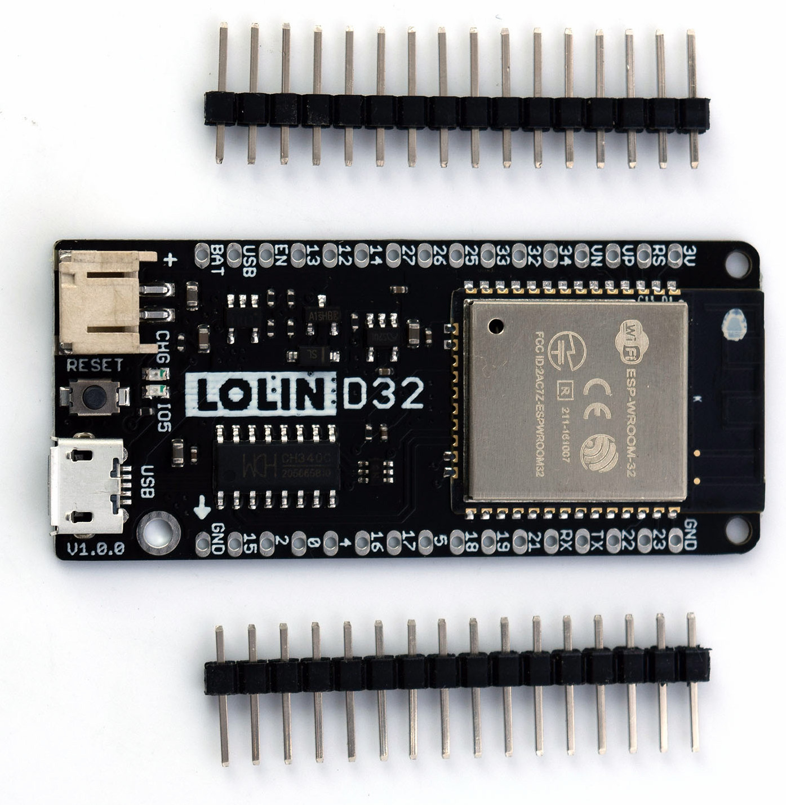

Keg Cop Assembly
#####################

Brew Bubbles runs on an ESP8266 controller. To detect the information to be logged, you need to connect specific devices to the controller. I have provided a circuit board design, sometimes called a “shield” to make this easier.

Assembly is not difficult, but it does require some basic soldering.

Materials Required
*********************

This project uses widely-available and inexpensive components. You may find you are better off buying a resistor assortment, for instance, or buying 10 or 20 of a piece at a time for a nominal cost from China.  You will need toorder the printed circuit boards from a supply house. The heart of the system is, of course, the controller.

Because there are multiple ways to configure this Keg Cop system, I will use my single Kegerator, three taps, with temperature control setup as an example. Other configurations may be detailed on the :ref:`planning <planning>` page.

Gather the following parts and pieces to get started:

Controller
============

The ESP32 controller is paired with many different “developer boards” to make connections easier. While you can buy a bare ESP32 chip, you will walk that road alone.

The developer board used in this project is the Lolin D32 v1.0.0 (not the Pro or 2.0.) Wherever you purchase it, make sure it is an official Espressif ESP32-WROOM-32 Module and that it says 4MB (or sometimes shown as 32Mb which is 4 megaBYTES converted to megaBITS.)  There is a version sometimes called "LED" whihc means there is an annoying blinking LED when a battery is not connected.  It will work, and so long as it's in a case you won't notice the blinking.  Also, be sure it comes with the 16-pin male and female headers, or else you will need to get them elsewhere. It's very common to only have the male headers in the package.

You can find the Lolin D32 in many places.  Lolin D32 is one of maybe hundreds of development boards. Their prime delivery method to hobbyists seems to be `the Lolin store on AliExpress <https://www.aliexpress.com/item/32808551116.html>`_. 

AliExpress also seems to be the least expensive path, but of course ordering direct from China does take a bit longer than other methods.  You will spend more but get your hands on the device quicker if you purchase from `Amazon <https://www.amazon.com/Genuine-Original-LOLIN-D32-V2-0-0/dp/B07T1SCXYW>`_ or any other place you can find it.

Printed Circuit Boards
==========================

This configuration will use the following three boards:

- `Tall Boy main board <https://dirtypcbs.com/store/designer/details/4818/6457/keg-cop-tallboy>`_
- `Sensor board <https://dirtypcbs.com/store/designer/details/4818/6459/keg-cop-sensor-breakout>`_
- 3 x `Daisy Chain boards <https://dirtypcbs.com/store/designer/details/4818/6458/keg-cop-daisy-chain>`_

The links in the above list will take you to DirtyPCBs where I have uploaded the designs.  When you purchase the boards there, you are paying a small premium (10%) which goes into my account. That credit is used in the development of these and other projects. Anyone who has done development like this can tell you how many boards we go through, and the cost is not insignificant. You may absolutely take the files from GitHub and upload them yourself to avoid that small markup if you choose. If you do purchase them here, it's only fair I tell you about it, and what I will do with the credits.

Components
================

Modifications
================

The `pcb directory <https://github.com/lbussy/keg-cop/tree/master/pcb>`_ in the repository contains the Eagle files for the printed circuit board shield supporting Keg Cop.  You are free to download the design files, modify them, and upload them to the PCB manufacturer of your choice.  If you would like to personalize these board designs, you may modify them with Autodesk’s EAGLE. EAGLE is a scriptable electronic design automation (EDA) application with schematic capture, printed circuit board (PCB) layout, auto-router, and computer-aided manufacturing (CAM) features. EAGLE stands for Easily Applicable Graphical Layout Editor and is developed by CadSoft Computer GmbH.
