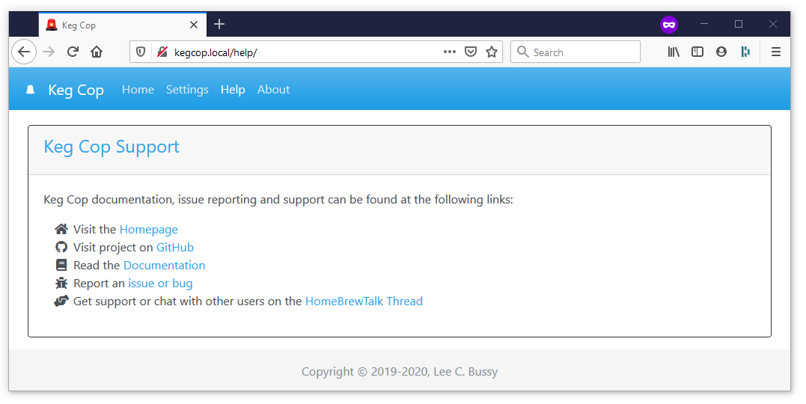

Help Links
################

The Help page displays important support links for Keg Cop:

- `Visit the Homepage <https://www.kegcop.com>`_: A link to the Keg Cop main website.
- `Visit project on GitHub <https://github.com/lbussys/keg-cop>`_: A link to the main GitHub repository.
- `Read the Documentation <https://docs.kegcop.com>`_: A link to this documentation.
- `Report an issue or bug <https://github.com/lbussy/keg-cop/issues>`_: A link to the Issues list within the GitHub repository. Use this for real issues or bugs; support should be redirected to the next link.
- `Get support or chat with other users on the HomebrewTalk Thread <https://support.kegcop.com>`_: A link to the main thread on HomebrewTalk where general discussions and "how do I?" conversations should be posted.
