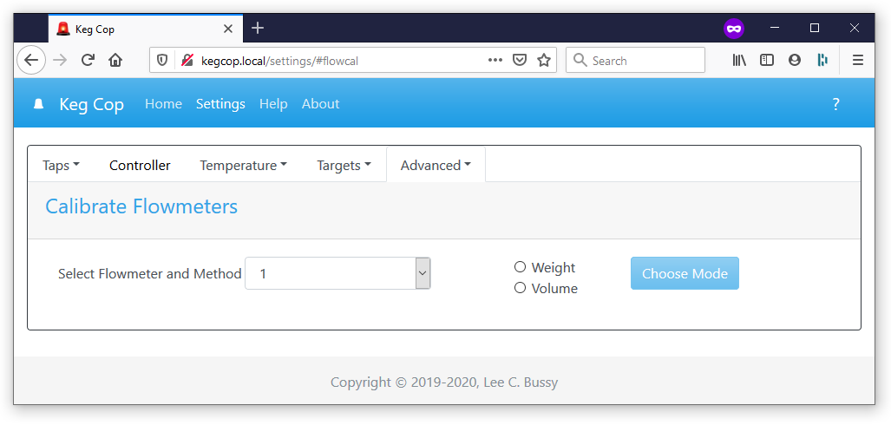
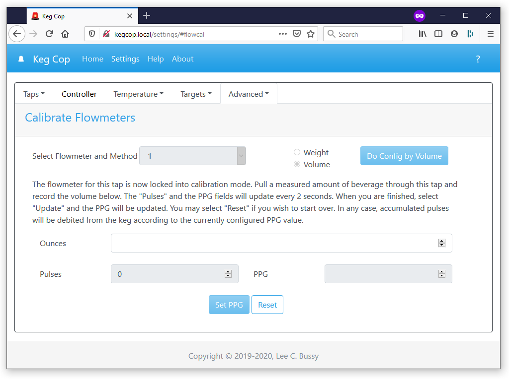
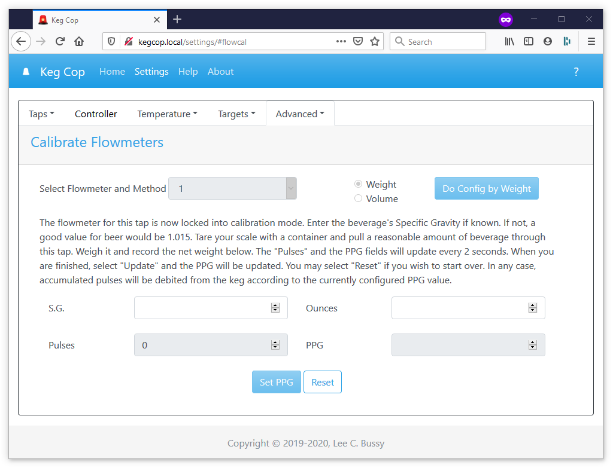

.. _calibrate:

Calibrate Flowmeters
######################

Upon opening the Calibrate Flowmeters page, you are presented with a dropdown to select the flowmeter to be calibrated. After choosing the meter, select a radio button to choose between calibrating by a weight or a volume measurement.  The Choose Mode button will activate upon choosing a method. Pressing this button will open an additional dialog, depending upon your choice.

Calibration by volume is often less accurate than weight; however, using volume is the most straightforward method.

Calibration by Volume
**********************

Calibration by volume involves measuring a tap pull of a beverage and then recording that measurement. A larger pour will be more accurate than a smaller one. The volume measurement is done in the units for which Keg Cop is currently configured. Use milliliters if using metric, or ounces if using imperial measurements.

As you draw a beverage during calibration, the Pulses field will update with the pulses measured. If you have entered a volume, the pulses per unit (PPG or PPL) will be calculated. Both the Pulses and pulses per unit will update every two seconds.

When you are satisfied, use the Set PPG/PPL button to lock in the calibration. If you wish to reset the calculation back to its default, use the Reset button instead of saving. The pulses collected will be debited according to the new rate if you save, or the previously configured rate if you reset.

Calibration by Weight
**********************

Since some beverages may have a specific gravity other than 1.000 and we are actually measuring pours by volume, adjustment of the measure taking into account the SG is possible.  If you are unsure of what to use, 1.015 is a good middle of the road number for most homebrewed beer.  If you leave it blank, 1.000 (water equivalence) will be used.

Tare your scale with the container you will be using. Pull an amount of beverage roughly equivalent to a standard pour. Weigh the container again to determine the net weight. Use the units of measure appropriate for the current Keg Cop configuration; use ounces for imperial and grams for metric.

As you draw a beverage during calibration, the Pulses field will update with the pulses measured. If you have entered a weight, the pulses per unit (PPG or PPL) will be calculated. Both the Pulses and pulses per unit will update every two seconds.

When you are satisfied, use the Set PPG/PPL button to lock in the calibration. If you wish to reset the calculation back to its default, use the Reset button instead of saving. The pulses collected will be debited according to the new rate if you save, or the previously configured rate if you reset.
