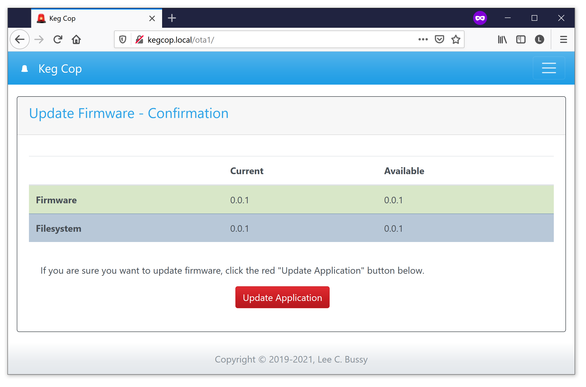
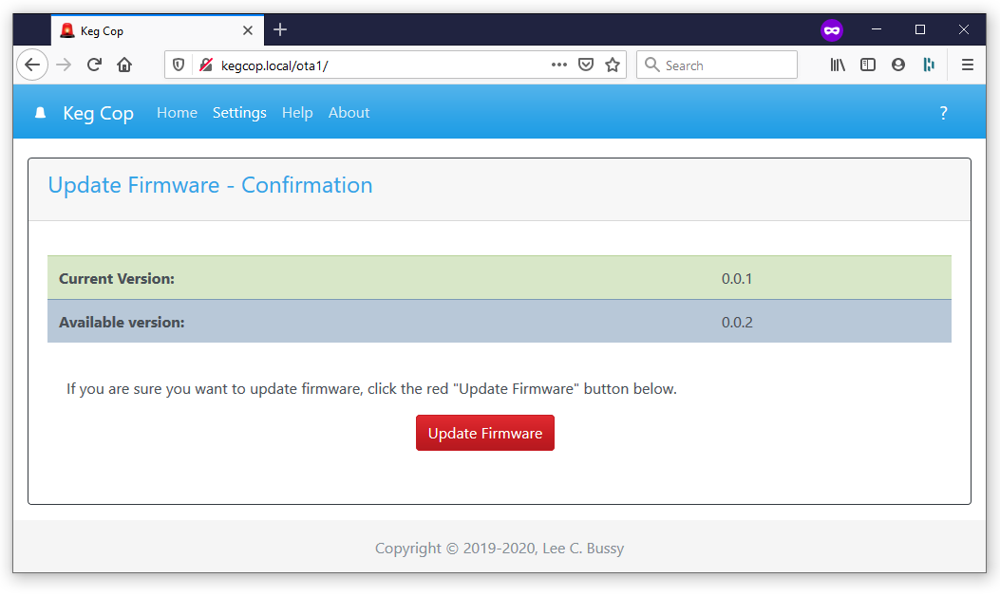
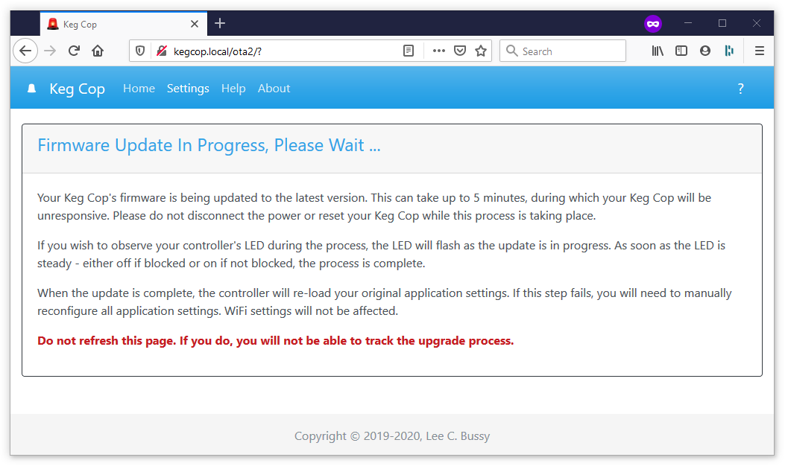

.. _update:

Update Controller
########################

Pressing the "Check Version" button in this UI will bring up a subsequent page displaying the local and upstream Keg Cop version.

Regardless of the version available, pressing the "Update Firmware" button on this page will queue an update of the system application and website. Your settings will be retained.

The process will take five or more minutes, depending upon your network configuration. When complete, the page will refresh to the home page.
