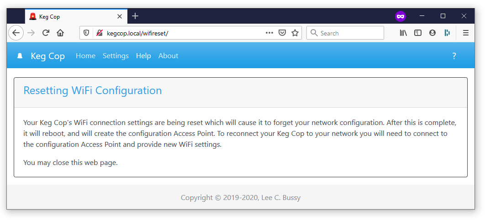

.. _resetwifi:

Reset WiFi
##############

.. image:: wifi.png
   :scale: 50%
   :align: center
   :alt: Reset WiFi

If you plan to move your Keg Cop to a new location or connect to a new network, resetting the network settings ahead of time is a good idea.  Pressing the "Reset WiFi" button is an irreversible action and will delete the current WiFi configuration.

After this action, you will need to reconnect to the *kegcop* access point to reconfigure the WiFi settings.
