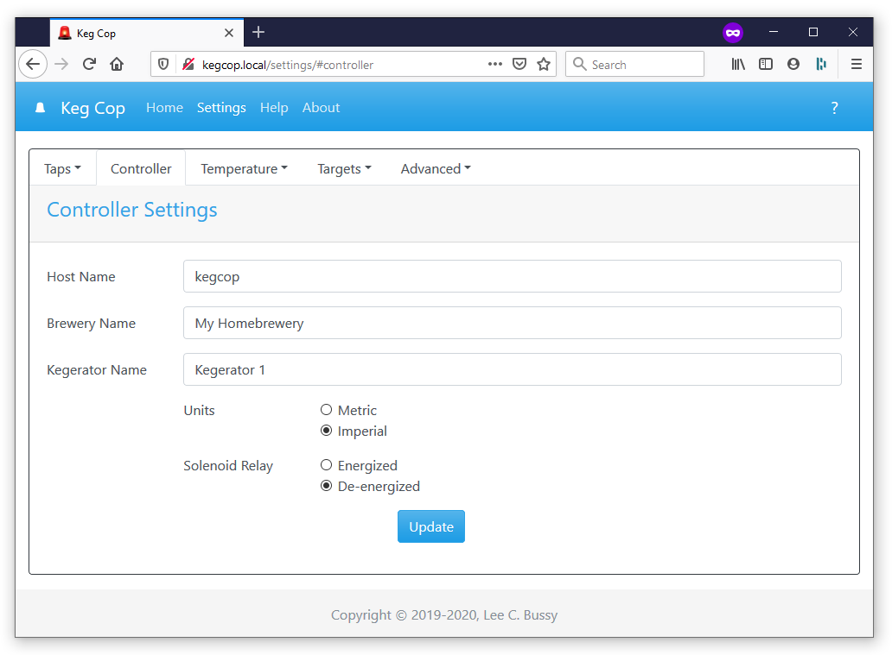

.. _controller:

Controller Settings
######################

The Controller Settings page allows configuration of settings which control the top-level settings of the system:

- **Host Name**: This is the network hostname, to which you will connect as  *{hostname}*.local. Do not include the .local portion; the mDNS system will append this automatically.  This name must be unique on the network, or unexpected behavior may result.  Most computer systems and mobile devices support mDNS. For more information, please see the :ref:`mDNS FAQ <faq-mdns>`.
- **Brewery Name**: This is displayed on the :ref:`main page <home>`. It concatenates with the Kegerator name, e.g., "*Main Kegerator in Silver Fox Brewery.*"
- **Kegerator Name**: This displays on the main page. It concatenates with the Brewery name, e.g., "*Main Kegerator in Silver Fox Brewery.*" This name reports to any upstream system.
- **Units**:
   - **Metric**: Volume reports in liters and milliliters, the temperature in degrees Celcius, and you will enter the flowmeter calibration in pulses per liter.
   - **Imperial**: Volume reports in gallons and ounces, the temperature in degrees Fahrenheit, you will enter the flowmeter calibration in pulses per gallon.
- **Solenoid Relay**: This will energize or de-energize a relay. This setting controls a solenoid or bank of solenoids to turn the beverage flow on or off. I have provided this point for convenience; I intend for an upstream system to control it.
- **Functionality**:
   - **Keg Cop**: The controller will operate in stand-alone mode or report to upstream systems as Keg Cop.
   - **RaspberryPints**: The controller will disable all serial communication except for that which is compatible with the RaspberryPints 2.x systems. This setting should allow it to be a direct replacement for the Arduino or AlaMode.
   - **RPints RandR+**: The controller will disable all serial communication except for that which is compatible with the RandR+ fork of the RaspberryPints 2.x systems. This setting should allow it to be a direct replacement for the Arduino or AlaMode.
