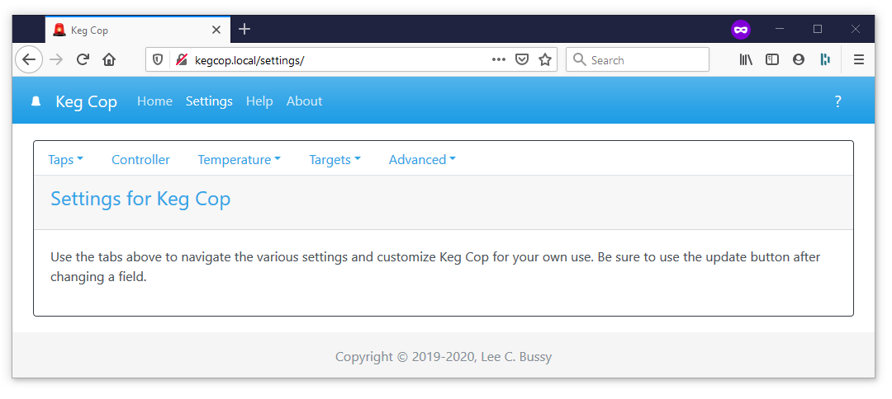

.. _settings:

Settings Page
######################

.. todo::

    `Operations and Configuration <https://keg-cop.readthedocs.io/en/latest/operations/index.html>`_ and `Settings <https://keg-cop.readthedocs.io/en/latest/context/settings/index.html>`_ page should be merged. I'm pretty sure every link on the former page jumps to the latter. Maybe take the descriptions and add them to the table entries on the Settings page (maybe at the end of each line in parenthesis and comma-delimited).

The settings page provides a tabbed sub-menu for application settings and configuration:

.. toctree::
    :maxdepth: 1
    :titlesonly:
    :glob:

    controller/index
    taps/index
    temperature/control/index
    temperature/sensors/index
    targets/kegscreen/index
    targets/url/index
    advanced/calibrate/index
    advanced/reset/index
    advanced/update/index
    advanced/wifi/index
