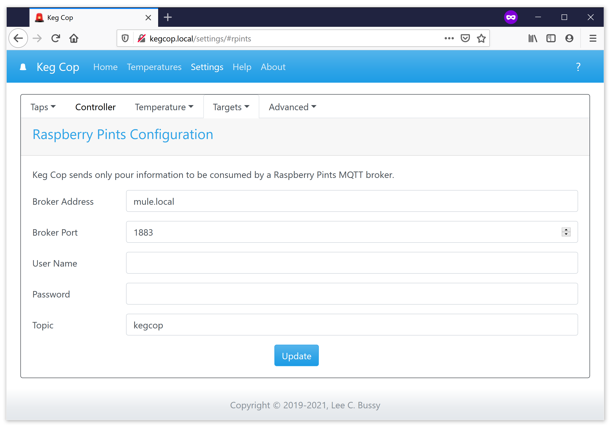

.. _rpints:

Raspberry Pints Target
#######################

The Raspberry Pints page allows you to forward pours to an MQTT-enabled Raspberry Pints installation.  The settings are as follows:

- *Broker Address:* [Required] Enter the fully-qualified domain name of the Raspberry Pints target.  You may use \*.local addresses, IP addresses, or Internet-facing addresses.
- *Broker Port:* [Required] The port to use, the default MQTT port is 1883.
- *User Name:* [Optional] If required by the MQTT broker, this is the user name by which you will be authenticated. Clear if not needed.
- *Password:* [Optional] If required by the MQTT broker, this is the password with which you will be authenticated. Clear if not needed.
- *Topic:* [Required] The topic to which the pours will be published.
