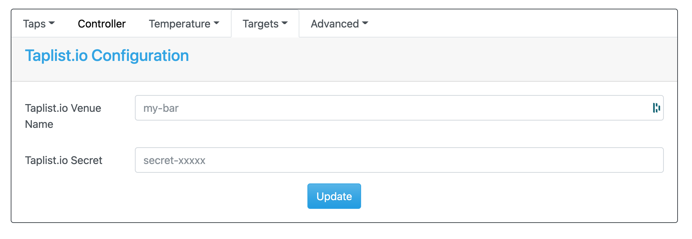

.. _taplistio:

Taplist.io Target
#################

The Taplist.io page allows you to forward pours to Taplist.io.  The settings are as follows:

- *Taplist.io Venue Name:* [Required] Venue/site name. Found in your account at taplist.io under Dashboard > Web Settings > Web Address.
- *Taplist.io Secret:* [Required] Taplistio API Secret. Generated in your account at taplist.io under Account > Integrations > API. Begins with 'secret-' (NOT 'key-').

In addition to the venue/secret, you must link each Keg Cop tap to a Taplist.io tap. This setting is configured on each tap's individual configuration tab.

- *Taplist.io Tap Number:* [Required] Taplist.io tap number to link this tap to. Set to 0 to disable sending this tap. 
