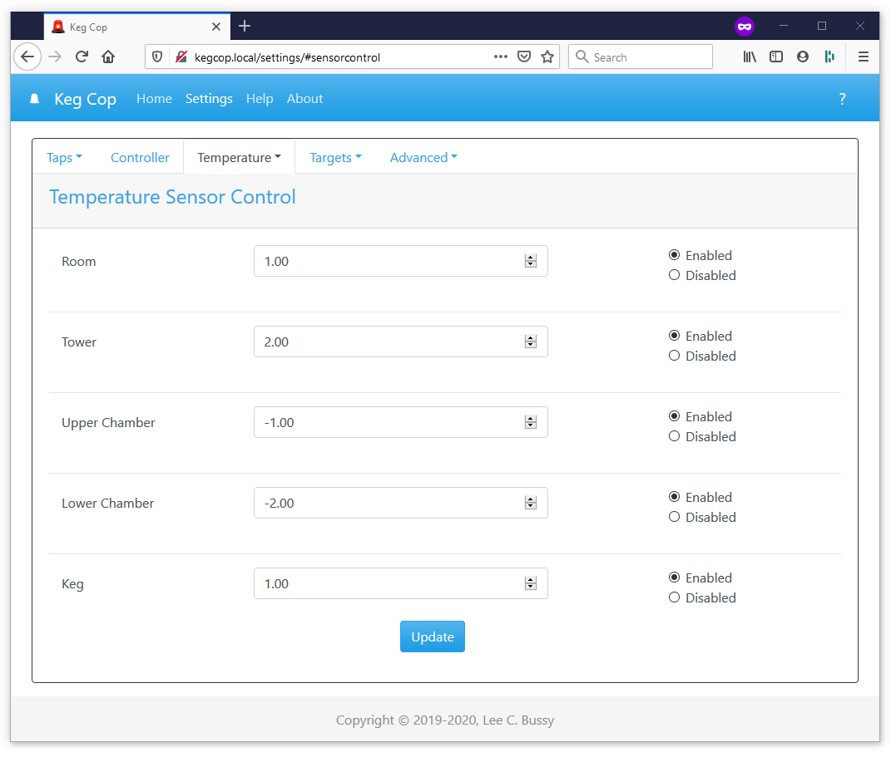

.. _sensors:

Sensor Control
#######################

You may apply a positive or negative calibration value individually for each temperature sensor. 

If a sensor is unused, or if you wish to disable it, mark it as such.
