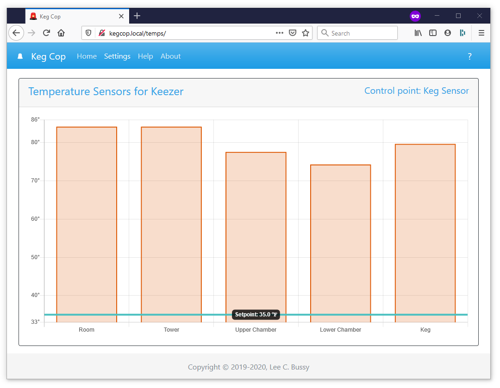

.. _temperatures:

Temperatures
####################

When you have configured the Keg Cop system with temperature sensors, you may navigate to it with the Temperature Sensor link on the main menu.  Its presence in the main menu bar is dynamic, so it will only appear after the page has fully loaded.

There is a link to the Temperature page via the temperature display and cooling status box in the top-right corner of the home page. 

The Temperature Sensors page displays a bar for each active temperature sensor.  If you have configured the system to control temperatures, a horizontal bar will appear across the chart showing the setpoint.

The selected control point will appear in the top-right of the box and link to the Temperature Control settings page.
