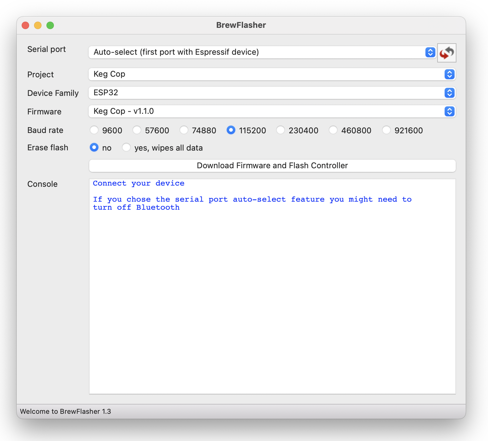

.. _firmware:

Installing the Firmware
=======================

Flashing the firmware may be done from many platforms with a variety of tools.  The following is a method that have I have tested. Other methods may work; however, I have less experience with them.

Important Note:
    The ESP32 has a memory section which is not erased or written over by flashing firmware. If you have previously used your controller for any other tasks, I recommend that you wipe the flash memory before you begin. The method to do that differs by the tool used, and more information follows in the sections below.

**Before proceeding, connect your controller via the USB port to your workstation.**

Preferred Method for Windows and Macs
--------------------------------------

BrewFlasher_ is a stand-alone desktop application for Windows and macOS designed to simplify flashing Keg Cop (And other brewing-related firmware) to your controller.

It handles everything - locating the correct firmware, downloading it, setting the correct flash options/offsets, and flashing the firmware. There is no fumbling with the command line or worrying about esptool options. Select the project you want to flash, click a button, and you have finished.

You may download BrewFlasher_ from its GitHub release page or BrewFlasher.com_.

You will use the following settings:

- Serial port: Auto-select
- Project: Key Cop
- Device Family: ESP32
- Firmware: Keg Cop (latest version)
- Baud rate: 921600 (any should work, this is faster)
- Flash mode: Dual I/O (DIO)
- Erase flash: yes, wipes all data (this avoids problems later on - it will wipe wifi settings if any)

Now click the button that says, "Download Firmware and Flash Controller."

Here_ is a short video produced by the author of BrewFlasher.

Firmware Updates
----------------

The web application provides Over The Air (OTA) update functionality for upgrades.  Navigate to the *Settings* page and on the *Adanced* menu, select *Update Application*.

.. _BrewFlasher: https://github.com/thorrak/brewflasher
.. _BrewFlasher.com: https://www.brewflasher.com/
.. _esptool: https://github.com/espressif/esptool
.. _repository: https://github.com/espressif/esptool
.. _download: https://www.espressif.com/en/support/download/other-tools
.. _Here: https://youtu.be/7KZiRoxn-z8
