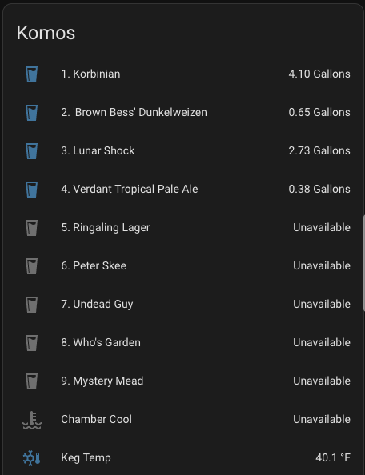

# Integration with Home Assistant

## Introduction

Since the release of version 1.3.0, Keg Cop has supported sending its data to [Home Assistant](https://www.home-assistant.io/), a free and open-source home automation platform.  Home Assistant can then display this data on a dashboard and/or use it as the basis for one or more automation.  This page will describe how to configure Home Assistant to receive this data, how to configure Keg Cop to send it, and how to build an attractive dashboard to display your tap status.

## Configuring Home Assistant

This guide assumes you have Home Assistant OS installed and running, whether on x86 hardware, a Raspberry Pi, a virtual machine, or some other hardware.  Consult the [Home Assistant documentation](https://www.home-assistant.io/installation/), if necessary, for assistance.  You should also configure your Home Assistant installation to have a static IP address because you'll use this later to configure Keg Cop.  You'll first need to configure Home Assistant to receive data via MQTT.

Log into the Home Assistant web interface and go to Settings -> Add-ons -> Add-on store, and click on **Mosquitto broker,** then click **Install.**  Once it installs, turn on **Start on boot** and **Watchdog,** and then click **Start.**

Next, configure the integration.  Go to Settings -> Devices & Services, then click the **Configure** button for MQTT.  A window will pop up asking, "Do you want to configure Home Assistant to connect to the MQTT broker provided by the add-on Mosquitto broker?" Click **Submit**.  At the next pop-up window, click **Finish**.  Home Assistant can now receive MQTT messages from Keg Cop (and other sources if desired).

Finally, you'll need to set up a user for Keg Cop.  Go to Settings -> People, and click on **Add Person**.  Enter a descriptive name like "KegCop User," and turn on "Allow person to login." In the following form, enter a username and password.  You'll probably also want to turn on "Can only log in from the local network," mainly if your Home Assistant installation is available remotely.  Click **Create**.

## Configuring Keg Cop

You'll next need to configure Keg Cop to send its data to Home Assistant.  To do this, open the Keg Cop web interface, go to Settings, then to Targets -> Home Assistant.  The Broker Address will be the IP address of your Home Assistant installation, the Port will remain at its default of 1883, and the username and password will be the ones you configured above.  Leave Autodiscovery Topic at its default of "homeassistant." Click **Update**.

## Building the Dashboard

Keg Cop is now configured to send its data to Home Assistant.  If you've kept the default Home Assistant dashboard, you'll see its data populate there.  It will look something like this:

To create a more focused and attractive dashboard, in the Home Assistant web interface, go to Settings -> Dashboards, and then click **Add Dashboard**.  Call it whatever you like ("kegcop" in this example) and choose any icon you like (mdi:keg is a good choice).  Then click **Create**.  Next to your newly-created dashboard in the list, click **Open**.

The new dashboard will default to showing all your data, which you don't want.  Click on the three dots in the upper-right corner, and then **Edit dashboard**.

 Turn on "Start with an empty dashboard" and click **Take control**.

 

 You now have an empty dashboard.  At the top, you can click on the pencil icon to the right of "Edit UI" to give it a name--something like "On Tap at Home Brewery" might be appropriate.  You'll next want to add some data to this dashboard.  Start by clicking the **Add Card** button in the lower-right corner.  In the window that pops up, select **Horizontal Stack**.  The Horizontal stack card lets you stack two (or more) cards side-by-side.  In this case, we'll be stacking a text field to describe the beer on tap and a gauge showing how much beer is left.

 A new window, titled **Horizontal Stack Card Configuration,** will pop up, letting you select the first card in the stack.  Find and select the **Markdown** card.

 In the Markdown card, you can enter a title (I'd use the tap number and the beer name) and any text you like to describe the beer.  You can format this text, if desired, using Markdown syntax.  It will look something like this:

 

 Once you've entered whatever text you like, click the + to the upper right to add another card.  For this, you'll want to select **Gauge**.

 The gauge is the card that will show how much of your beer is remaining.  In the **Entity (required)** field, you'll need to select the entity that represents this amount, which will be named with the tap number followed by the name of the beer--in the example below, "1.  Korbinian".  You'll want to set "maximum" to the volume of your keg in whatever units you've told Keg Cop to use; I'm using 5 for five-gallon Corny kegs.  I also turned on the needle gauge and the severity indications, though this is at your preference.  The overall card configuration looks like this:

 

 Once you're finished, click **Save** in the lower-right corner.  Repeat this process, creating additional Horizontal Stack cards for your other taps.  When finished, click the **Done** button at the upper-right.  You should have a dashboard that looks something like this:

 

 ## Further reading

 For further information on Home Assistant dashboards, consult the [Home Assistant documentation](https://www.home-assistant.io/dashboards/).