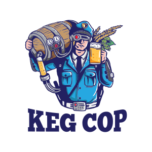

About Keg Cop
###################

We like to brew. Arguably, that means we want to drink. Sure, we can go down to the corner store and buy beer, but that's not in our nature. We spend eight hours brewing so that we can spend a couple of hours enjoying our craft with our friends. Don't try to justify it, or figure out why. It just is.

Invariably, the homebrewer moves from cleaning and filling 24 bottles at a time, to filling one big bottle - a keg.  The problem with that, for all the benefits, is that we cannot quickly tell how much is left.  We can open the keezer and try to guess by lifting it, but that is inaccurate, potentially dangerous, and sometimes just impossible.  Keg Cop watches your kegs and tells you exactly how much of your precious brew is left.

At the core, Keg Cop is a small, inexpensive microcontroller far more capable than the computers used for the Apollo moon missions.  You connect the controller to one or more flow meters. Keg Cop makes incredibly precise measurements while you dispense your beer.  The capacity and amount remaining are displayed on a compact and mobile responsive web page.  Optionally, you may configure Keg Cop to upload data to several other systems.

Keg Cop is an entirely Free and Open Source offering.  I have provided all source files, including optional 3D printed parts.  You can build this, what follows is the how.

.. toctree::
   :maxdepth: 1
   :caption: Table of Contents:
   :titlesonly:
   :glob:

   planning/index
   pcbassembly/index
   firmware/index
   networking/index
   sysassembly/index
   operations/index
   api/index
   troubleshooting/index
   context/index
   contributions/index
   todo

.. todo::
   Spellcheck!
