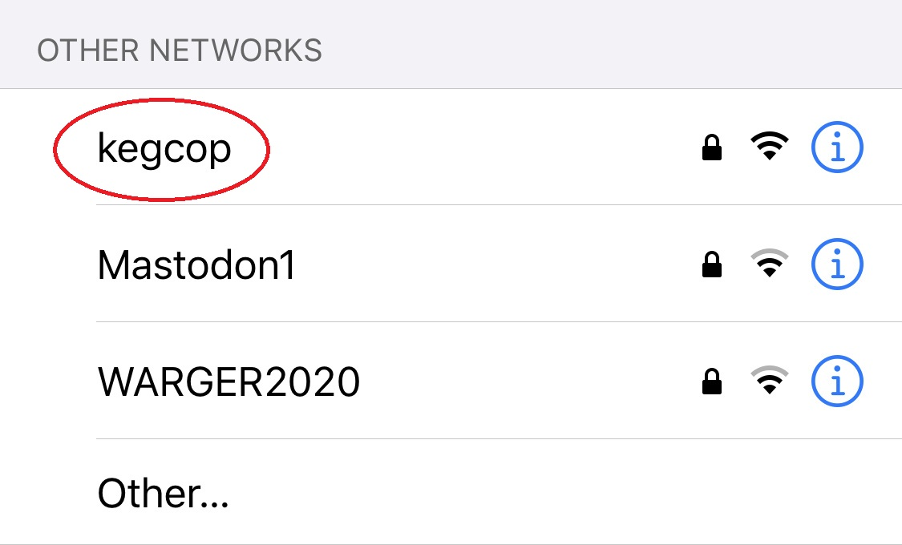
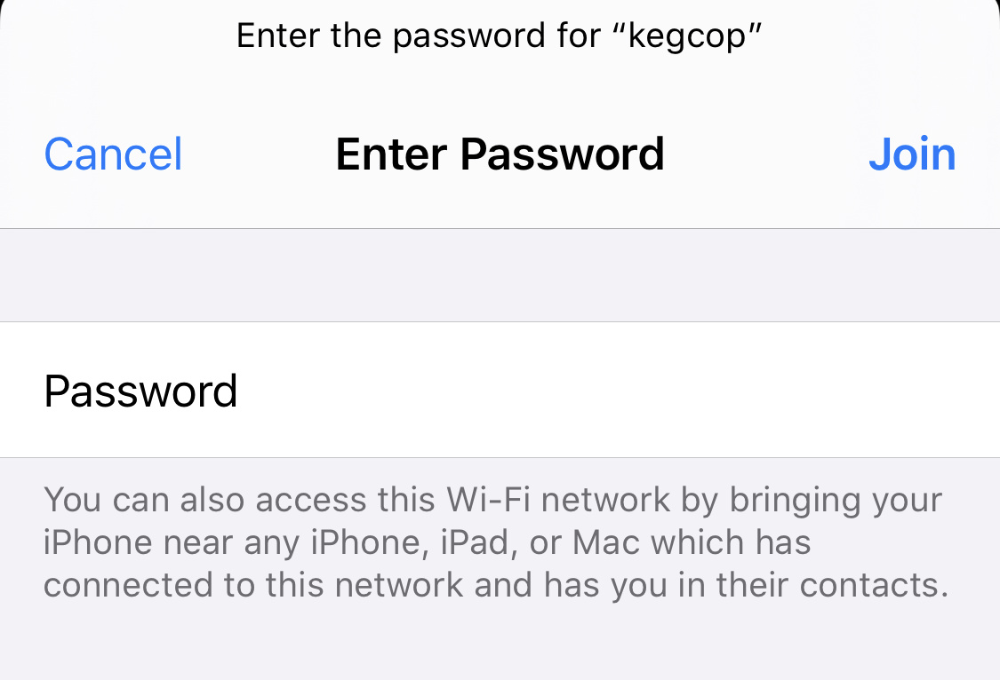
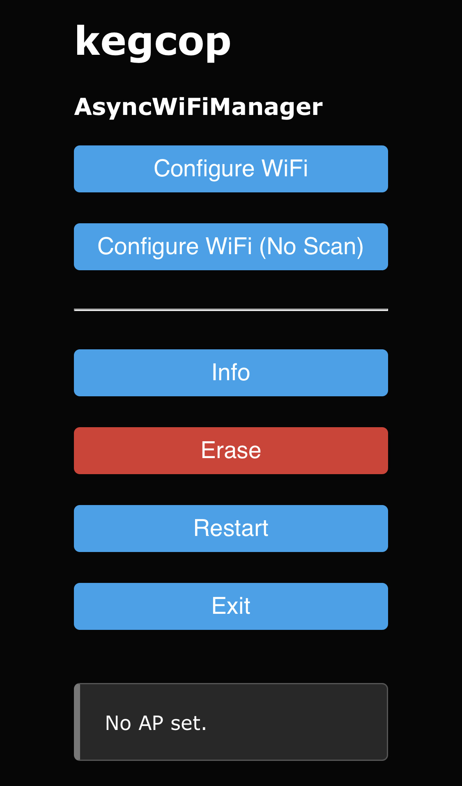
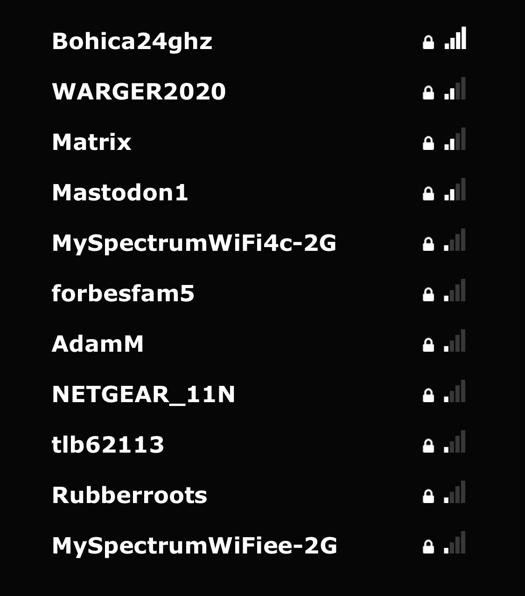
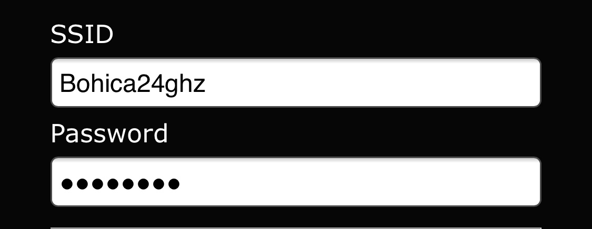

Set Up Networking
#####################

After flashing the firmware for the first time or erasing network settings, your controller will not participate in any WiFi networks. It starts in what is called "Access Point (AP) Mode," where it serves as a sort of stand-alone wireless network. The on-board LED will flash at 0.5Hz, or one second on, one second off.

Initial Network Settings
**************************

You may use any wireless-capable device to connect to the access point, however best results are often obtained using a mobile device. In the following examples, I use an iPhone; however, any device should be very similar. Be aware that using the same machine on which you follow these instructions may result in you not being able to read the instructions when you connect to the Keg Cop AP. No Internet will be available to your phone or laptop while you go through the process.

In your device settings, search for an available access point named "kegcop."

Connect to the "kegcop" network, and when prompted, enter the password "kegcop12."

When you connect to the Keg Cop AP, your mobile device or computer should detect it as a "captive portal." This means any DNS queries made will always return the IP address of the AP. This is very similar to using free WiFi at a restaurant. Your device or computer should open a web browser and connect to the captive portal. If not, open a web browser and connect to the IP address 192.168.1.1.

The captive portal will show, allowing you to continue.

On the portal page, select "Configure WiFi" to continue.

You should see a list of nearby wireless networks. Select your WiFi network, and the SSID of the network will populate the SSID field. Next, enter your WiFi password. You may also perform a static IP configuration on this page. Such a setup should be used only by those who understand the implications and can determine and test the proper settings.

Click the "Save" button.

.. image:: 6_wait_for_connect.jpg
   :scale: 20%
   :align: center
   :alt: Wait For Connect

The controller will attempt to connect to the network. If the connection is successful, the Keg Cop AP will go away, and your device should connect to your last known good connection. You may have to reconnect your computer or phone manually. In the case of the iPhone, if the Keg Cop does not connect to your local wireless, the AP will not terminate, and your browser will remain on this screen.  You can hit the back ("<") arrow to return to the WiFi configuration and try again.

If all goes as expected, the controller's LED will flash as it performs various configuration steps, and finally, the LED will remain off. Here you may proceed. If you have issues, check the :ref:`troubleshooting <troubleshooting>` page for more information.

Network Settings Change
**************************

At some point, you may need to change your WiFi settings. This is easier if you remember to do it while you are still able to connect to the application. However, you may raise the access point without being able to access the Keg Cop Application.

Reset Settings
================

The easiest way to change settings is to access the Keg Cop web page.  In Settings > Advanced > Reset Wifi you may :ref:`reset wifi settings <resetwifi>`.  After that is done, you can re-join the Keg Cop soft AP and configure a new network.

Re-Raise AP
================

If the Keg Cop controller is unable to access the configured WiFi network, it should drop into AP mode and allow configuration. It will indicate this by the AP-mode flashing (0.5Hz) of the on-board LED.

If this does not work, or if you prefer, you may raise the AP by an electrical connection. Take a piece of wire and short pin 13 to ground. Then, reset the controller by pressing the reset button or cycling power. The controller will detect pin 13 being low on startup and enter AP mode.

