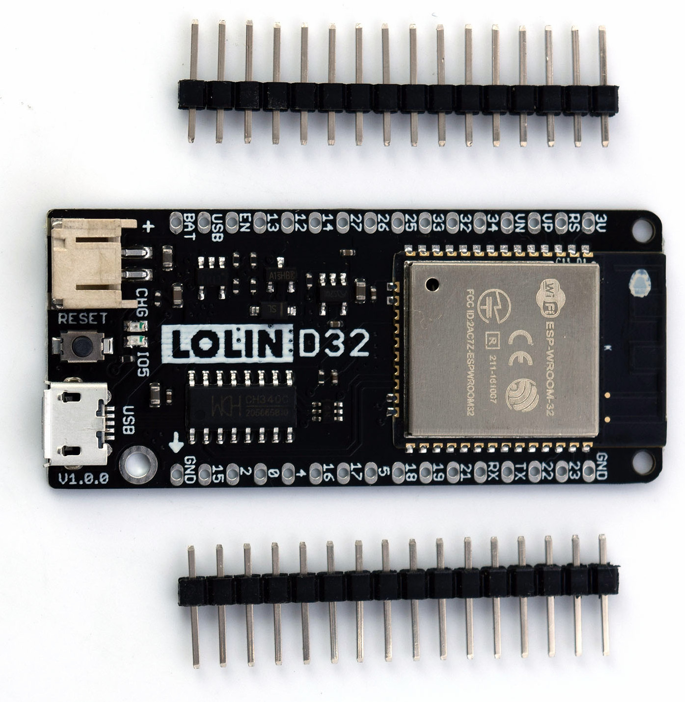
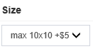

.. _pcb:

PCB Assembly
#####################

Keg Cop runs on an ESP32 controller. To detect the information to be logged, you need to connect specific devices to the controller. I have provided a main circuit board design, as well as several breakouts for your use.

Assembly is not difficult, but it does require some basic soldering.

Materials Required
*********************

This project uses widely-available and inexpensive components. You may find you are better off buying a resistor assortment, for instance, or buying 10 or 20 of a piece at a time for a nominal cost from China.  You will need toorder the printed circuit boards from a supply house. The heart of the system is, of course, the controller.

Because there are multiple ways to configure this Keg Cop system, I will demonstrate using my single Kegerator, three taps, and a temperature control setup. Other configurations may be detailed on the :ref:`planning <planning>` page.

Gather the following parts and pieces to get started:

Controller
============

The ESP32 controller is paired with many different "developer boards" to make connections easier. While you can buy a bare ESP32 chip, you will walk that road alone.

The developer board used in this project is the Lolin D32 v1.0.0 (not the Pro or 2.0.) Wherever you purchase it, make sure it is an official Espressif ESP32-WROOM-32 Module. It says 4MB (or sometimes shown as 32Mb which is 4 megaBYTES converted to megaBITS.)  There is a version sometimes called "LED" which means there is an annoying blinking LED when a battery is not connected.  It will work, and so long as it's in a case, you won't notice the blinking.  Be sure it comes with the 16-pin male and female headers, or else you will need to get them elsewhere. It's very common to only have the male headers in the package.

You can find the Lolin D32 in many places.  Lolin D32 is one of maybe hundreds of development boards. Their prime delivery method to hobbyists seems to be `the Lolin store on AliExpress <https://www.aliexpress.com/item/32808551116.html>`_. 

AliExpress also seems to be the least expensive path, but of course, ordering direct from China does take a bit longer than other methods.  You will spend more but get your hands on the device quicker if you purchase from `Amazon <https://www.amazon.com/Genuine-Original-LOLIN-D32-V2-0-0/dp/B07T1SCXYW>`_ or any other place you can find it.

Printed Circuit Boards
==========================

This configuration will use the following three boards:

- \*\*\* `Tall Boy main board <https://dirtypcbs.com/store/designer/details/4818/6457/keg-cop-tallboy>`_
- `Sensor board <https://dirtypcbs.com/store/designer/details/4818/6460/keg-cop-sensor-breakout>`_
- 3 x `Daisy Chain boards <https://dirtypcbs.com/store/designer/details/4818/6458/keg-cop-daisy-chain>`_

The links will take you to DirtyPCBs where I have uploaded the designs.  When you purchase the boards there, you are paying a small premium (10%), which goes into my account. That credit is used in the development of these and other projects. Anyone who has done development like this can tell you how many boards we go through, and the cost is not insignificant. You may absolutely take the files from GitHub and upload them yourself to avoid that small markup if you choose. If you do purchase them here, it's only fair I tell you about it, and what I will do with the credits.

These links will allow you to order boards in increments of ±10.  Sometimes you might get 11, sometimes nine, it's cheap and from China and that's how it works. Think of it as a lottery. If you end up with extras, I encourage you to share with others.

(\*\*\*) - The main board is > than the "standard" Dirty PCB size of 5x5cm.  When you get to the ordering page, you MUST select 10x10, which is a slightly higher price.  If you forget this, I think they may adjust the price afterward, but I feel like for such low prices, I want to be upfront about things. On the same page, you may also select other than the default board color, which is red.

Components
================

For this configuration, we will use the following components:

**Tallboy Main Board:**

- 2 x `0.1μF (1.0nF) Ceramic Capacitor (102) 2.54mm spacing <https://www.aliexpress.com/item/32868001945.html>`_ (C1, 3) (Note: Same link as below, select the proper item)
- 2 x `1.0μF Ceramic Capacitor (105) 2.54mm spacing <https://www.aliexpress.com/item/32868001945.html>`_ (C2, C4) (Note: Same link as above, select the proper item)
- \*1 x `DS18B20 PCB-mount sensor <https://www.aliexpress.com/item/1901263688.html>`_ (IC1) (Note: Multiple items on the page, be sure to select the proper item)
- 5 x `2.2kΩ 1/4W 5% Axial Resistor <https://www.aliexpress.com/item/32660635741.html>`_ (R1-R5) (Note: Multiple items on the page, be sure to select the proper item)
- 2 x `RJ45 8-pin 90° no shield PCM-mount jack <https://www.aliexpress.com/item/32736146888.html>`_
- 1 x `2-pin Straight Male Header <https://www.aliexpress.com/item/2040310671.html>`_ (POWER) (Note: More than enough in one lot for all three headers)
- \*1 x `3-pin Straight Male Header <https://www.aliexpress.com/item/2040310671.html>`_ (ROOM) (Note: More than enough in one lot for all three headers)
- 1 x `4-pin Straight Male Header <https://www.aliexpress.com/item/2040310671.html>`_ (RELAY) (Note: More than enough in one lot for all three headers)

**Sensor Board:**

- 1 x `RJ45 8-pin 90° no shield PCM-mount jack <https://www.aliexpress.com/item/32736146888.html>`_
- 4 x `3-pin terminal block <https://www.aliexpress.com/item/32965348107.html>`_

**Daisy Chain Boards (multiply all numbers x 3 for three flowmeters):**

- 2 x `RJ45 8-pin 90° no shield PCM-mount jack <https://www.aliexpress.com/item/32736146888.html>`_
- 1 x `3-pin terminal block <https://www.aliexpress.com/item/32965348107.html>`_

(*) - Optional items for use when a room temperature sensor is desired. Either a DS18B20 sensor with a lead is used, or a PCB-mount sensor is employed.

Soldering
===========

You are going to have to solder. If you have legitimately never soldered anything before, I recommend you spend a few minutes on YouTube and watch a few videos. It is not hard at all once you get the hang of it. And, while the boards are comparatively small, the components chosen are simple through-hole parts, which may be easily soldered by a beginner with a little patience.

Be sure to use flux when you solder. Liquid flux is the easiest to use. Be sure to get both sides of the board because you want the solder to flow to both sides.  After you solder from behind, flip the board over to make sure you get a good flow. If not, you can always touch up from the top (but don't tell anyone you cheated.)

I do not intend to provide a step-by-step on how to solder here. Still, I recommend the following part installation order for ease of assembly:

- Resistors - The shortest mounted components, soldering the resistors to the board first is the least challenging. They are also some of the most tolerant components, so these grant you some experience to get you going.
- Capacitors - The next tallest components, these should go on next. They are also relatively tolerant of heat, so you can continue to refine your skills. Be sure to get them as close to the board as possible since having them stick up changes their intended impact on the circuit.
- DS18B20 Sensor - Now that you are sure of your skills, these sensors should be soldered on next. Be careful not to overheat the devices, but they are not too sensitive.
- Pin headers and terminal blocks - These components are not sensitive to the heat at all except for the plastic.
- RJ45 Jacks - These are the tallest items and should be soldered on last.

When you solder the sensor board, you have a choice. It was designed to put the openings of the 3-pin terminal block pointing *in* to then route the cables out one end of a case. You may point them out if you prefer that setup.

Once you have finished soldering the shield, make sure to clean off the flux. You can use cheap vodka or Everclear, or a commercially available flux solvent.

Modifications
***************

The `pcb directory <https://github.com/lbussy/keg-cop/tree/master/pcb>`_ in the repository contains the Eagle files for the printed circuit board shield supporting Keg Cop.  You are free to download the design files, modify them, and upload them to the PCB manufacturer of your choice.  If you would like to personalize these board designs, you may modify them with Autodesk's EAGLE. EAGLE is a scriptable electronic design automation (EDA) application with schematic capture, printed circuit board (PCB) layout, auto-router, and computer-aided manufacturing (CAM) features. EAGLE stands for Easily Applicable Graphical Layout Editor and is developed by CadSoft Computer GmbH.
