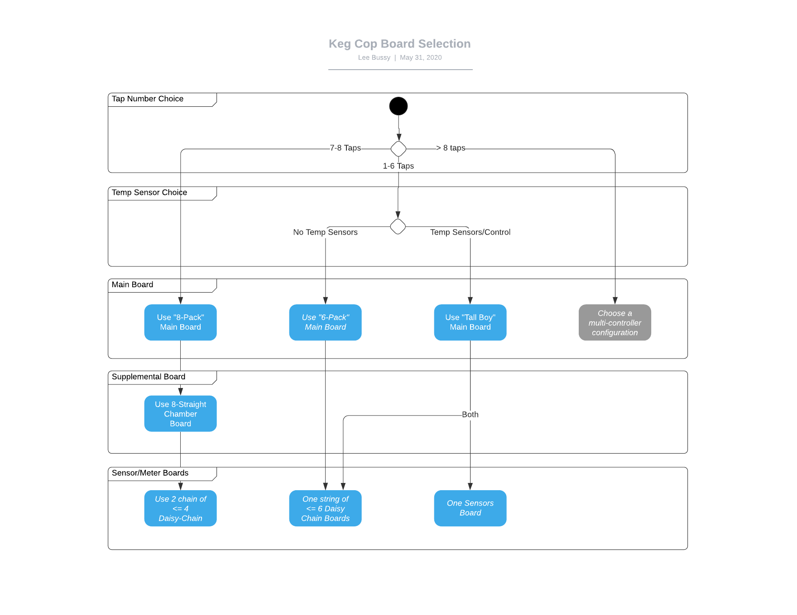

Project Planning
=============================

It would be best if you did a little planning before you begin.  Keg Cop is configurable and extensible, and as such, you should know what you hope to achieve. The flowchart below should help you decide on the PCB configuration that best supports your system.

- **Tap Number Choice**: This is the most basic and most important decision. The controller choice for this project allowed up to eight pins for flow meters. While the somewhat obsessive part inside me forced me to allow up to eight taps, this system works most optimally with one through six. This is a result of choosing easily-sourced Ethernet cables as the connectivity between boards.  You may always choose to edit any of the supplied PCB designs to meet your own needs.
- **Temp Sensor Choice**: Since this system provides temperature control of your keg chamber, temperature sensors are naturally supported and required for temperature control. Keg Cop supports up to five temperature sensors, including one for room temperature.
- **Main Board**: The main board selection is a product of the above two choices. You need only one main board per system.
    - 8-Pack - This is a board that uses two Ethernet cables to extend the pins to the breakout board.
    - 6-Pack - This board is the most straightforward choice, providing no temperature control capabilities. A single Ethernet cable connects to the flowmeter chain.
    - Tall-Boy - The Tall-Boy is probably the most flexible design for those who have one to six taps. It provides a single Ethernet going to the flowmeter chain, plus another Ethernet port connecting to the chamber sensors. A temperature sensor for Room temperature mounted to the board.
- **Supplemental Board**: The 8-Straight board serves as a splitter/concentrator for all of the sensors/meters. You only need one supplemental board per system having seven or eight taps.
- **Sensor/Meter Boards**: The final boards in the chain serve as connectors to the physical aspects of the system.
    - Daisy-Chain Boards: These small boards, one per flowmeter, are used to connect the flowmeter(2) into the system. There is an "In" and an "Out" port, creating a chain of up to six sensors. The first on the chain is always number one, and so on.
    - Sensor Board: This is a breakout board for connecting up to five temperature sensors.
