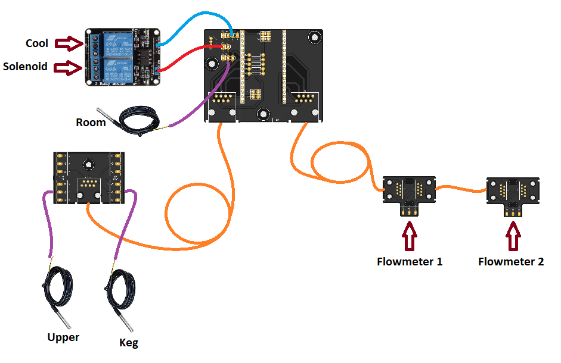
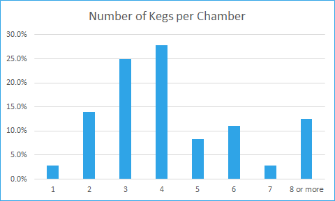
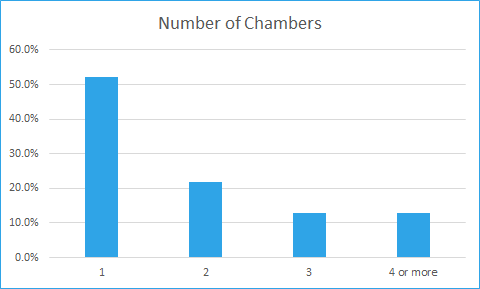

.. _planning:

Project Planning
####################

Keg Cop is capable of a wide variety of configurations. Each has similar building blocks, and you may apply that methodology to a variety of applications. Here is a system with two flow meters, a room temp sensor, a keg temp sensor, a chamber sensor, cooling control, and a solenoid.

It would be best if you did a little planning before you begin.  Keg Cop is configurable and extensible, and as such, you should know what you hope to achieve.

- **Tap Number Choice**: This is the most basic and most important decision. The controller choice for this project allowed up to nine pins for flow meters. The system works by utilizing up to three strings of three flowmeters each.  This optimization is a result of choosing easily-sourced Ethernet cables as the connectivity between boards.
- **Temp Sensor Choice**: Since this system provides temperature control of your keg chamber, temperature sensors are naturally supported and required for temperature control. Keg Cop supports up to five temperature sensors, including one for room temperature.
- **Main Board - One main board per system:**: It provides a single Ethernet going to the flowmeter chain and another Ethernet port connecting to the chamber sensors. A temperature sensor for Room temperature mounted to the board.
- **Sensor/Meter Boards - Connectors to the physical aspects of the system:**
    - Daisy-Chain Boards: These small boards, one per flowmeter, connect the flowmeter(s) into the system. There is an "In" and an "Out" connector, creating a chain of up to nine sensors. The first on the chain is always number one, and so on.
    - Sensor Board: This is a breakout board for connecting up to five temperature sensors.

The BOM for the electronics may be found on the :doc:`PCB Assembly </pcbassembly/index>` page.

Flowmeters
*************

The flowmeter is probably the single most important and yet the most challenging part to source. It's not because flowmeters are hard to find; it's because there are so many choices. Your choices will dictate some of the operations choices for the application.

Keg Cop will support a different flowmeter on each tap if that's how you want to go.

You can choose from any number of flowmeters using a single data (pulse/frequency) line and powered from 3V3. Some choices used by the homebrewing community include:

- Swissflow SF800_ Low-Pressure Flow Meter
- YF-S401_ Water Flow Sensor Meter Flowmeter Coffee Dispenser Counter 0.3-6 L/min (eBay)
- Liquid Flow Meter - Plastic 1/2" NPS Threaded ID: 828_ (Adafruit)

While one or two of the above links may eventually grow stale, what is listed should give you enough information to find a suitable device. Swissflow is probably the most expensive device. However, it is likely the most accurate one available. To be completely transparent, they helped my development by defraying a portion of my meters' expenses. I would have purchased them at the list price if they had not.

Buy once, cry once, as my grandfather used to say.

.. _SF800: http://www.swissflow.com/sf800.html
.. _YF-S401: https://www.ebay.com/itm/YF-S401-Water-Flow-Sensor-Meter-Flowmeter-Coffee-Dispenser-Counter-0-3-6-L-min/282112630770
.. _828: https://www.adafruit.com/product/828

A Practical Example
***********************

Take, for example, my three-tap kegerator. I need to decide whether or not I will use temperature sensors. I do want to use Keg Cop to control my Kegerator temperatures, so I know I need both a sensor board and one daisy chain board per flow meter.  My setup therefore is:

- One main board
- One Sensors board
- Three Daisy Chain boards with flowmeters

If you have a similar setup, you may always add new Daisy Chain boards as needed. The most appropriate installation uses one Keg Cop per kegerator/keezer.  If you are fortunate enough to have more than one kegerator, plan for separate Keg Cop systems.

Why This Approach?
*******************

I polled the community some time back, asking `how many kegs people had in their kegerator/keezer <https://www.homebrewtalk.com/threads/how-many-kegs-in-your-keezer-kegerator.672039/>`_. I learned that most people have four kegs per unit (27.8%) with three kegs coming in a close second (25%).  Eighty-seven percent (87.5) of the respondents had seven or fewer kegs.  In hindsight, I should have set up the poll with a clear separation between having eight kegs and having nine or more, but nobody is perfect.

In another thread, I asked `how many kegerators or keezers people had <https://www.homebrewtalk.com/threads/how-many-kegerators-keezers.672043/>`_.  This poll showed that the vast majority of homebrewers have a single chamber (52.2%), with less than a quarter of the respondents (21.7%) having two. I feel that the approach I have taken of one per chamber is reasonable and will not be burdensome. 

There are always edge cases, people with morgue-sized chest freezers in each room with ten kegs. My feeling is that these people have already invested a significant amount in their systems. These homebrewers are used to things just being more complicated at scale, and having multiple Keg Cops is the least of their worries.

Design Limitations
*******************

There are also some practical considerations to these design constraints:

- **Off the shelf cabling:** The cabling method is what I consider a shortcoming in some DIY projects. One often finds instructions to "connect the widget arm to the maniform" without any indication of how to do it. Illustrations invariably show a rainbow of DuPont wires plugged into a breadboard. That's fine for development work but does not address real-life needs. People need a prescriptive method to connect components. It should be simple, prevent crossed circuits, and not have an entry cost for tooling, which creates hidden costs. Ethernet cables check almost all our needs. They are straight-through (where phone cords have a crossover) and can be purchased locally or online.  They are also available in many lengths and have a reasonably secure connection mechanism.
- **Cabling Capacity:** Having chosen the prescribed cabling, this does create an inherent limitation. An Ethernet cable has eight wires. A flowmeter has power and ground, shared across each meter, plus a discrete data line. Each data line needs a paired ground with which it is twisted within the bundle to prevent electrical interference.  That means a single Ethernet cable can serve a maximum of three flowmeters. A similar situation exists with the temperature sensors. Using all available temperature sensor slots consumes seven of the eight available wires.
- **Controller Capacity:**
   - A controller has a given number of pins with which to interact with the physical world. Some pins also have a function internal to the controller or the development board (such as the LED.) This project uses almost all available pins on the chosen ESP32 development board.
   - The OneWire sensors I use for temperatures could work with all sensors on a single wire for data (hence the "OneWire" name.)  You are familiar with the slight inconvenience this poses if you have used one of the various fermentation temperature controllers. You have to connect one sensor at a time and assign its use, or heat/cool one sensor at a time so that you can label it. Each sensor has an internal address that allows it to be assigned to a specific use or name; however, figuring out which one is a little cumbersome. I wanted a more straightforward method of one sensor per pin so that there is an explicit physical configuration without such addressing concerns. Because of this approach, I have reserved five controller pins for temperature sensors.
   - The flow meters do not have any method of resolving a sensor. The data pin pulses as the flow is detected. On the controller, we use one pin per sensor to catch each pulse independent of the others. Therefore, I have reserved nine pins for flow meters.
   - Temperature control means that there needs to be a method of turning on and off the cooling. One pin is used for this to control a relay.
   - Solenoid control is a feature that exists in many of the previous keg display systems. Because of the keg lines' proximity, this device seemed like the appropriate place to put the solenoid control. We use one pin for this, intended to turn on or off all solenoids at once using a relay.

Some of the pins available to us are not appropriate for all uses. Some pins will prevent the controller from booting if held high or low as it would be if connected to a sensor or flow meter. Some pins will be set high or low during the boot process regardless of what the program will do when it starts. Such a pin attached to the cooling relay may cause the refrigerator compressor to short-cycle.

I do not doubt that some crafty person might look at this and devise a more glamorous approach. For instance, there are I2C boards that would extend the system's capabilities. My final criteria for this design is to have a simple, compact design, capable of providing a prescriptive path to success for the average DIYer. Taking a very simplistic, 1:1 approach to interfacing software to the physical world meets this goal. If you are one of those people who think you can do it better, you have my blessing to fork the project and do your best.
