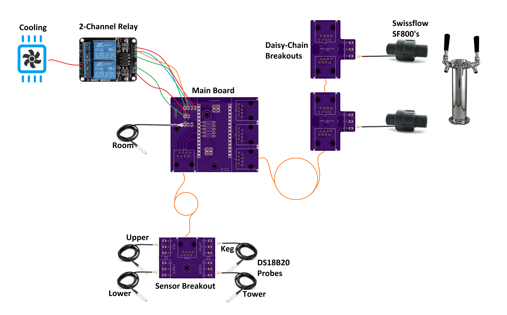

.. _assembly:

System Assembly
###################

As you have learned in the discussion on :ref:`planning your system <planning>`, Keg Cop is capable of a wide variety of configurations. Each has similar building blocks, and you may apply that methodology to a variety of applications.

Described here are a system with two flow meters, a room temp sensor, a keg temp sensor, a chamber sensor, cooling control, and a solenoid.

The main board is the centerpiece of the system. It hosts the controller and serves as a connection for the relay, sensors, and flow meters.

Power
*********

You will power the system with a micro-USB cable plugged directly into the controller's USB port.

Flowmeters
************

In the diagram above, you can see a crucial feature of the system; a single Ethernet cable leads to one or more flowmeters. The first cable is from the main board (Tallboy, in this case) to the first flowmeter.  Using the Daisy Chain boards, the first connection is always Flowmeter #1.  Any subsequent connections will be #2, #3, and so on up to six.

Temperature Sensors
********************

Temperature sensors are optional; however, we will use them in this exemplar configuration.

Room Temperature
==================

The room temperature sensor is optional, and we use it for display/reference purposes only. If you choose to utilize a room-temperature sensor, you have a choice.  Either solder a DS18B20 in a TO-92 package directly to the PCB or using a sensor pre-assembled on a lead.

If you use a TO-92 package sensor, be sure to provide ventilation for the main board. The ESP32 chip will generate some heat and throw off the readings if you do not.

Chamber Temperature
======================

Keg Cop offers four optional chamber sensors; we will use two for this example.  We will use a single Ethernet cable to connect the Sensor breakout board to the main board.  One pre-wired DS18B20 sensor is used each on the Keg and the Upper sensor ports.

Relays
************

This system will control both the cooling and solenoids. We will use two-channel 5VDC relay to provide this control.

Since the controller pins are 3V3 (3.3VCD), we use a separate 5VDC supply to the relay. This power connection is optional but recommended.  Most relays seem to do fine when actuated with 3V3, but two extra wires are incredibly cheap for some peace of mind.

Remove the jumper between JD-VCC and VCC on the relay board.  Connect the two-pin header labeled POWER on the main board in the following manner:

- JD-VCC on the relay to V on POWER header
- GND on the relay to G on POWER header
- NOTE: The VCC pin on the relay's three-pin header remains unused

We will use the four-pin header to control the relays. Connect the four-pin header labeled RELAY on the main board in the following manner:

- VCC on the relay to V on RELAY header
- IN2 on the relay to C on RELAY header
- IN1 on the relay to S on RELAY header
- GND on the relay to G on RELAY header

Cooling
========

In this diagram, we use Relay #2 for cooling. This document is not sufficient to describe how to do high voltage wiring. If you are not familiar with this concept, please seek out a licensed and insured electrician.

Generally, we use the is used to make or break the hot side of the high voltage electrical circuit. When used in this manner, run the hot leg to the COM2 terminal. Run the load side to the NO2 terminal.

Solenoid
=========

Solenoids come in a wide variety of configurations. I have designed this system to actuate a single relay to control one or more solenoids simultaneously. Power the solenoids with a separate, dedicated power supply of sufficient amperage and proper voltage for the relays you implement.  Run them in parallel, through the COM1 and NO1 terminals on Relay #1.
