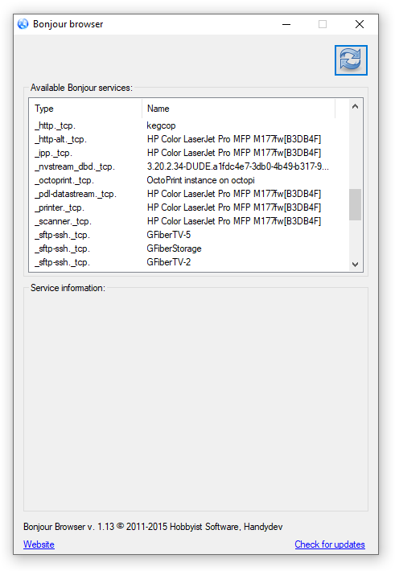

Troubleshooting
=================

.. _faq-mdns:

Cannot open Keg Cop by Name
````````````````````````````````

If someone is having problems with Windows 10 and the Arduino IDE is not finding IP address (Arduino UNO Wifi), try the following:

    Disable Windows mDNS:
    https://superuser.com/questions/1330027/how-to-enable-mdns-on-windows-10-build-17134

    And install the Bonjour program:
    https://bonjour.en.softonic.com/

To check if the mDNS server is operating, you can use Bonjour Browser (Windows):
https://hobbyistsoftware.com/bonjourbrowser

To check if the mDNS server is operating (using Android SmartPhone):
https://play.google.com/store/apps/details?id=com.druk.servicebrowser&hl=en_US
Or:
https://play.google.com/store/apps/details?id=net.he.networktools&hl=en_US

Before disabling Windows mDNS, sometimes the Arduino IDE found the address via mDNS. When the Arduino IDE didn't find the address, the smartphone did, so I started to suspect Windows.

Bonjour Browser:


