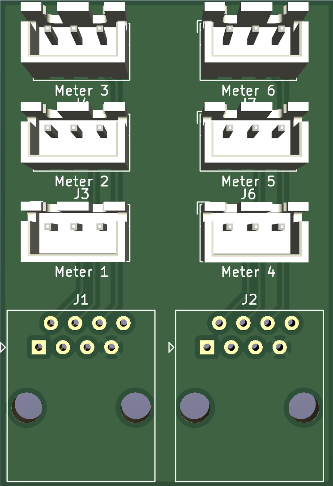
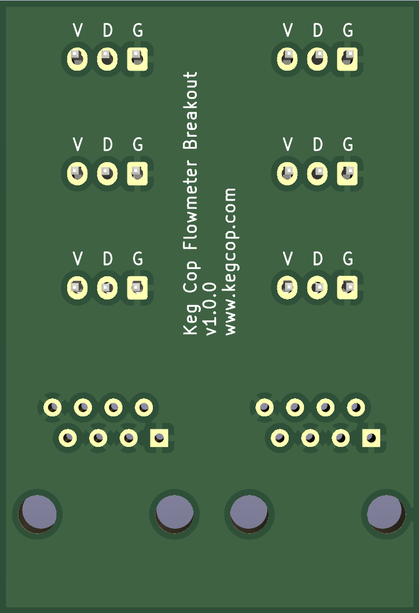

# Six-way Meter Breakout PCB

This PCB interfaces between the main Keg Cop board and up to six flow meters, which will connect via board-mounted JST-XH connectors.  This PCB is not designed to daisy-chain.

## Design info
This PCB was designed using [KiCad 6.0](https://www.kicad.org/), a free and open-source, cross-platform electronics design suite.  Design files are provided if you'd like to make changes to the design.  Otherwise, you can download the .zip file from the `Gerber` directory and upload to your PCB fab of choice.

## Board images
Front:

Back:

